## Video Game Sales Analysis

Mason Gliege, Ewan Farnum, Ishan Nichols

# Cleaning

First, we read the dataset and stored it as a dataframe. 

The data had some null sales numbers, so we replaced them with zeros. 

There were also null values for critic scores. Since there is no way to estimate scores on games using the existing data, we removed all rows with no score. Additionally, there were null values in total sales so those were also removed

``` r
library(tidyverse)
```

```
## ── Attaching core tidyverse packages ──────────────────────── tidyverse 2.0.0 ──
## ✔ dplyr     1.2.0     ✔ readr     2.2.0
## ✔ forcats   1.0.1     ✔ stringr   1.6.0
## ✔ ggplot2   4.0.2     ✔ tibble    3.3.1
## ✔ lubridate 1.9.5     ✔ tidyr     1.3.2
## ✔ purrr     1.2.1     
## ── Conflicts ────────────────────────────────────────── tidyverse_conflicts() ──
## ✖ dplyr::filter() masks stats::filter()
## ✖ dplyr::lag()    masks stats::lag()
## ℹ Use the conflicted package (<http://conflicted.r-lib.org/>) to force all conflicts to become errors
```

``` r
df <- read.csv("video_games_raw.csv")

str(df)
```

```
## 'data.frame':	64016 obs. of  14 variables:
##  $ img         : chr  "/games/boxart/full_6510540AmericaFrontccc.jpg" "/games/boxart/full_5563178AmericaFrontccc.jpg" "/games/boxart/827563ccc.jpg" "/games/boxart/full_9218923AmericaFrontccc.jpg" ...
##  $ title       : chr  "Grand Theft Auto V" "Grand Theft Auto V" "Grand Theft Auto: Vice City" "Grand Theft Auto V" ...
##  $ console     : chr  "PS3" "PS4" "PS2" "X360" ...
##  $ genre       : chr  "Action" "Action" "Action" "Action" ...
##  $ publisher   : chr  "Rockstar Games" "Rockstar Games" "Rockstar Games" "Rockstar Games" ...
##  $ developer   : chr  "Rockstar North" "Rockstar North" "Rockstar North" "Rockstar North" ...
##  $ critic_score: num  9.4 9.7 9.6 NA 8.1 8.7 8.8 9.8 8.4 8 ...
##  $ total_sales : num  20.3 19.4 16.1 15.9 15.1 ...
##  $ na_sales    : num  6.37 6.06 8.41 9.06 6.18 9.07 9.76 5.26 8.27 4.99 ...
##  $ jp_sales    : num  0.99 0.6 0.47 0.06 0.41 0.13 0.11 0.21 0.07 0.65 ...
##  $ pal_sales   : num  9.85 9.71 5.49 5.33 6.05 4.29 3.73 6.21 4.32 5.88 ...
##  $ other_sales : num  3.12 3.02 1.78 1.42 2.44 1.33 1.14 2.26 1.2 2.28 ...
##  $ release_date: chr  "17-09-2013" "18-11-2014" "28-10-2002" "17-09-2013" ...
##  $ last_update : chr  "" "03-01-2018" "" "" ...
```

``` r
df_clean <- df %>%
 mutate(
    jp_sales = replace_na(jp_sales, 0),
    na_sales = replace_na(na_sales, 0),
    pal_sales = replace_na(pal_sales, 0),
    other_sales = replace_na(other_sales, 0)
  ) %>%
  drop_na(critic_score, total_sales)
```

### Next, we split the games into different categories by sales.

Small Games: under 100k sales
Medium Games: between 100k and 1 million sales
Large Games: between 1 million and 10 million sales
Very_Large_Games: over 10 million sales


``` r
# Filter for games with less than 100k sales
small_games <- df_clean %>% 
  filter(total_sales < 0.1)

# Filter for games between 100k and 1 million sales
medium_games <- df_clean %>% 
  filter(total_sales >= 0.1 & total_sales < 1)

# Filter for games between 1 million and 10 million sales
large_games <- df_clean %>% 
  filter(total_sales >= 1 & total_sales < 10)

# Filter for games with 10 million or more sales
very_large_games <- df_clean %>% 
  filter(total_sales >= 10)
```

### Top 25 Best Selling Games

``` r
top_games <- df_clean %>%
  group_by(title)%>%
  summarise(total_sales = sum(total_sales))%>%
  arrange(desc(total_sales)) %>%
  head(25)

ggplot(top_games, aes(x = reorder(title, total_sales), y=total_sales)) +
  geom_col(fill = "steelblue") +
  coord_flip()+
  labs(
    title = "Top 25 Best-Selling Games",
    x = "Game",
    y = "Total Sales (millions)",
    fill = "Console"
  )
```

```
## Ignoring unknown labels:
## • fill : "Console"
```

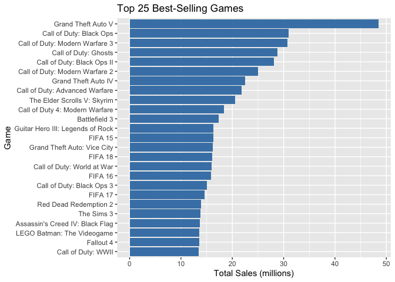<!-- -->
### Critic Score vs Sales

``` r
ggplot(df_clean, aes(x = critic_score, y = total_sales)) +
  geom_point(alpha =0.3)+
   labs(
    title = "Critic Score vs. Total Sales",
    x = "Critic Score",
    y = "Total Sales (millions)"
  ) 
```

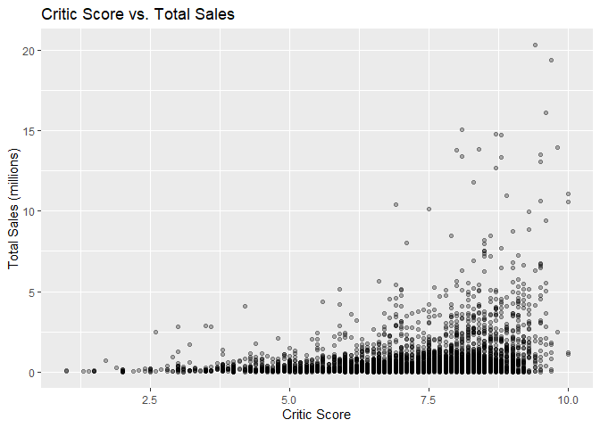<!-- -->

``` r
cor(df$critic_score, df$total_sales, use = "complete.obs")
```

```
## [1] 0.2811658
```


From the correlation coefficient of 0.28, we can see that critic score and total sales have a weak positive correlation. The graph shows that as the critic score increases, the total sales in millions increases slightly, but there is not a very obvious direct relationship. What we do see, however, is that all games with over 10 million sales have a critic score of at least 7. 

## Sales by Genre

``` r
genre_summary <-df_clean %>%
  group_by(genre) %>%
  summarise(
    avg_sales = mean(total_sales),
    count = n()
  ) %>%
  arrange(desc(avg_sales))

genre_summary
```

```
## # A tibble: 20 × 3
##    genre            avg_sales count
##    <chr>                <dbl> <int>
##  1 Sandbox              1.89      1
##  2 Shooter              1.18    516
##  3 Action-Adventure     1.00     76
##  4 Sports               0.902   538
##  5 Music                0.836    16
##  6 Action               0.784   733
##  7 Racing               0.746   338
##  8 Misc                 0.727   227
##  9 Simulation           0.659   151
## 10 Fighting             0.632   219
## 11 Adventure            0.572   230
## 12 Role-Playing         0.545   467
## 13 Platform             0.500   312
## 14 Party                0.375     8
## 15 Education            0.305     2
## 16 Board Game           0.3       1
## 17 MMO                  0.29      4
## 18 Puzzle               0.283   111
## 19 Strategy             0.268   175
## 20 Visual Novel         0.03      1
```

``` r
ggplot(genre_summary, aes(x = reorder(genre, avg_sales), y = avg_sales))+
  geom_col(fill = "steelblue")+
  coord_flip()+
  labs(
    title = "Average Sales by Genre",
    x = "Genre",
    y = "Average Total Sales (millions)"
  ) 
```

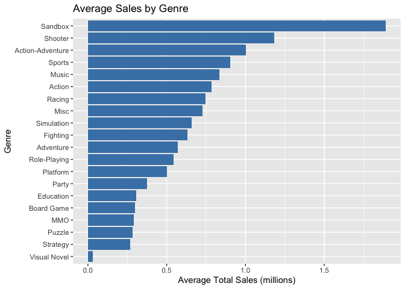<!-- -->
From the bar graph, we can see which genre of video games sell more on average. The bar graph shows this to be clearly sandbox, but this is not a reliable conclusion as there is only one sandbox game included in the dataset. The true most popular games which have a statistically significant sample size are shooter, action-adventure, and sports. The least popular games are strategy, puzzle, and platform. Again the graph shows genres like Visual Novel, MMO, and Board Game, but their sample sizes are too low to draw any conclusions.

## Average Sales by Console

``` r
console_summary <- df_clean %>%
  group_by(console) %>%
  summarise(
    avg_sales = mean(total_sales),
    count = n()
  )%>%
  filter(count >= 20) %>%
  arrange(desc(avg_sales))

ggplot(console_summary, aes(x = reorder(console, avg_sales), y = avg_sales)) +
  geom_col(fill = "steelblue") +
  coord_flip() +
   labs(
    title = "Consoles by Average Total Sales",
    x = "Console",
    y = "Average Total Sales (millions)"
  ) 
```

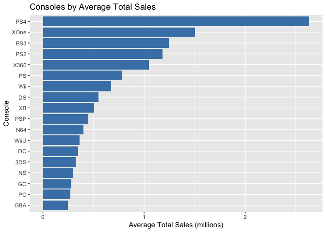<!-- -->

From the bar graph, we can see that the consoles with the highest average total game sales are the PS4 in first by far, with about 1 million average sales higher than the Xbox One, and then the PS3, PS2, Xbox 360 are next and all relatively close to each other. From the chart we can see that Playstation and Xbox lead average sales by a large margin compared to other consoles.

## Sales by Region

``` r
regional_sales <- df_clean %>%
  summarise(
    `North America` = sum(na_sales),
    `Japan` = sum(jp_sales),
    `Europe/Australia` = sum(pal_sales),
    `Other` = sum(other_sales)
  )%>%
  pivot_longer(everything(), names_to = "region", values_to= "sales")

ggplot(regional_sales, aes(x= reorder(region, sales), y = sales, fill = region))+
  geom_col()+
  coord_flip()+
   labs(
    title = "Total Sales by Region",
    x = "Region",
    y = "Total Sales (millions)"
  )
```

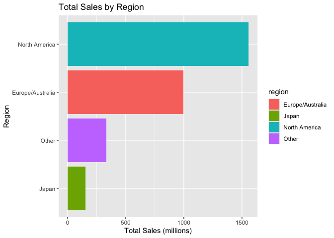<!-- -->

From the chart we can see that North America has the largest market for video games with around 1.5 billion total sales, next is Europe and Australia with around 1 billion. 

## Sales by game size category

``` r
small_games$sales_category <- "Small (<100k)"
medium_games$sales_category <- "Medium (100k-1M)"
large_games$sales_category <- "Large (1M-10M)"
very_large_games$sales_category <- "Very Large (10M+)"

all_games <- bind_rows(small_games, medium_games, large_games, very_large_games)

all_games$sales_category <-factor(all_games$sales_category,
                                  levels = c("Small (<100k)", "Medium (100k-1M)", "Large (1M-10M)", "Very Large (10M+)"))

ggplot(all_games, aes(x = sales_category, fill = sales_category))+
  geom_bar()+
  labs(
    title = "Distribution of Games by Sales Category",
    x = "Sales Category",
    y = "Number of Games"
  )
```

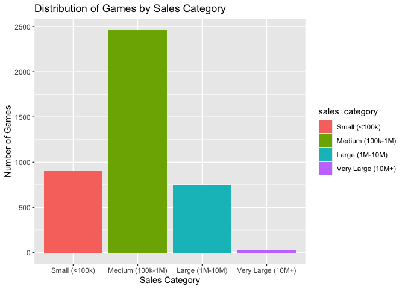<!-- -->
## score by game size


``` r
ggplot(all_games, aes(x = sales_category, y = critic_score, fill = sales_category)) +
  geom_boxplot() +
  labs(
    title = "Critic Score Distribution by Sales Category",
    x = "Sales Category",
    y = "Critic Score"
  ) 
```

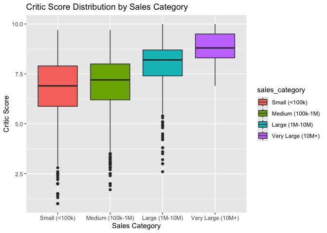<!-- -->

## Investigating correlation of specific genres (most popular)

``` r
#identify the top 5 genres of games
topGenres <- df_clean |> count(genre) |> top_n(5,n) |> pull(genre)

#filter with top genres
q1 <- df_clean |> filter(genre %in% topGenres)

#calculate correlations by genre
correlations <- q1 |> group_by(genre) |> summarise(
  corVal = cor(critic_score, total_sales, use = "complete.obs"),
  .groups = 'drop'
) |> mutate(
  label = paste0("r = ", round(corVal,2))
)


#plot with facet wrap and correlation
q1 |> ggplot(aes(x = critic_score, y = total_sales, color = genre)) +
  geom_point(alpha = 0.4) +
  geom_smooth(method = "lm", se = F, color = "black") + #trend line gets added
  geom_text(data = correlations, #this adds the corVal in the rigth spot for each genre
            aes(x = -Inf, y = Inf, label = label), 
            hjust = -0.2, vjust = 1.5, 
            color = "black", size = 5, fontface = "bold",
            inherit.aes = FALSE) +
  facet_wrap(~genre) +
  theme_minimal() +
  labs(
    title = "Critic score vs total sales across top genres",
    x = "Critic Score",
    y = "Total Sales (millions)"
  )
```

```
## `geom_smooth()` using formula = 'y ~ x'
```

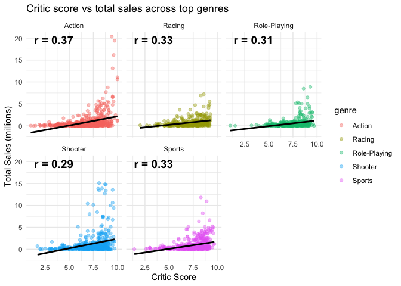<!-- -->
## Sales Over Time

``` r
df_clean <- df_clean %>%
  mutate(year = as.integer(str_sub(release_date, -4)))%>%
  filter(!is.na(year), year >= 1980, year <= 2023)

sales_by_year <- df_clean %>%
  group_by(year) %>%
  summarise(total_sales = sum(total_sales))

ggplot(sales_by_year, aes(x = year, y = total_sales)) +
  geom_line(color = "steelblue", linewidth = 1) +
  geom_point(color = "steelblue") +
  labs(
    title = "Total Game Sales Over Time",
    x = "Year",
    y = "Total Sales (millions)"
  ) 
```

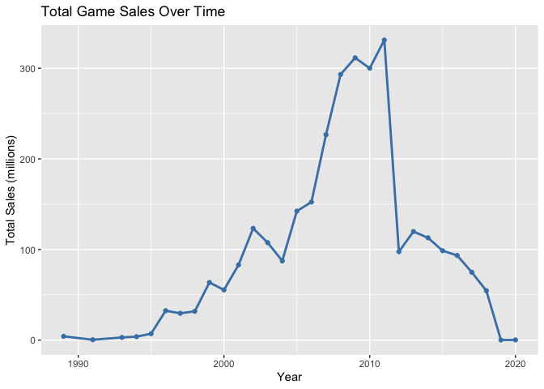<!-- -->

## Top 10 Publishers by Average Sales

``` r
publisher_summary <- df_clean %>%
  group_by(publisher) %>%
  summarise(
    avg_sales = mean(total_sales),
    count = n()
  ) %>%
  filter(count >= 10) %>%
  arrange(desc(avg_sales)) %>%
  head(10)

ggplot(publisher_summary, aes(x = reorder(publisher, avg_sales), y = avg_sales)) +
  geom_col(fill = "steelblue") +
  coord_flip() +
  labs(
    title = "Top 10 Publishers by Average Sales",
    x = "Publisher",
    y = "Average Sales per Game (millions)"
  )
```

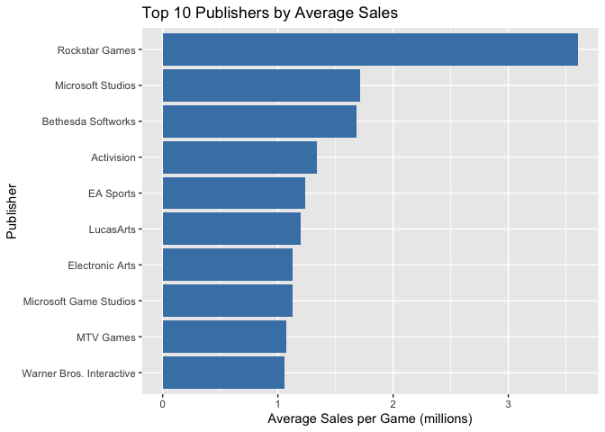<!-- -->

##Regional Sales by Genre

``` r
regional_genre <- df_clean %>%
  group_by(genre) %>%
  summarise(
    `North America` = sum(na_sales),
    `Japan` = sum(jp_sales),
    `Europe/Australia` = sum(pal_sales),
    `Other` = sum(other_sales)
  ) %>%
  pivot_longer(-genre, names_to = "region", values_to = "sales")

ggplot(regional_genre, aes(x = reorder(genre, sales), y = sales, fill = region)) +
  geom_col(position = "fill") +
  coord_flip() +
  labs(
    title = "Regional Sales Breakdown by Genre",
    x = "Genre",
    y = "Proportion of Sales",
    fill = "Region"
  )
```

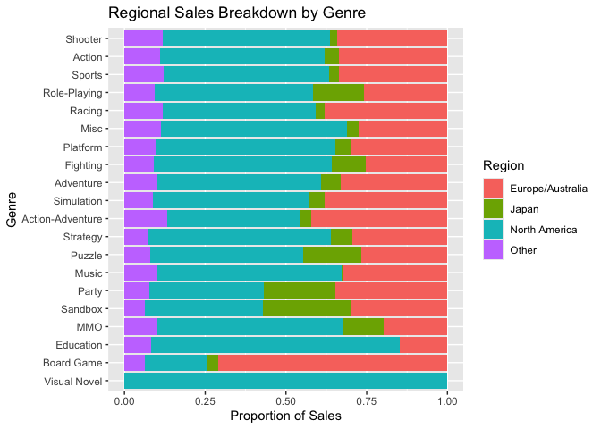<!-- -->

##Critic Score Distribution by Genre

``` r
valid_genres <- genre_summary %>% filter(count >= 10)

ggplot(df_clean %>% filter(genre %in% valid_genres$genre), aes(x = reorder(genre, critic_score, FUN = median), 
                     y = critic_score, fill = genre)) +
  geom_boxplot() +
  coord_flip() +
  labs(
    title = "Critic Score Distribution by Genre",
    x = "Genre",
    y = "Critic Score"
  ) +
  theme(legend.position = "none")
```

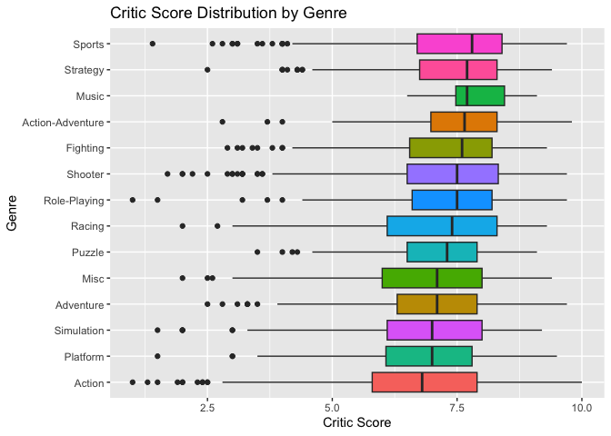<!-- -->
